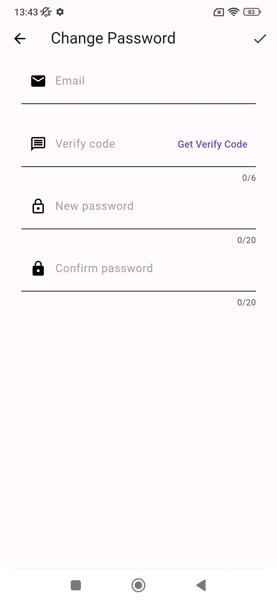

# TODO LIST ON FLUTTER

## Introduction

This app consists on a Todo List app, where you will be able to create tasks divided in diferent categories and manage them. It's done with the idea of learning more the usage of flutter and its advantages.

Language: Spanish & English

[Source of inspiration](https://github.com/asjqkkkk/flutter-todos)

## Screenshots

The user will be able to create a new account, login (credentials or biometry) and change the password in case of forgeting it. It has also being added security with the implementation of code verification send to the email and a login OTP (code send vía sms).

|  |  |  |
|:---:|:---:|:---:|

In the main page will be shown a carrousel formed with the categories of the user, where each category card will have 3 actions to choose from. In the bottom, there is a circular list of categories to chose from to add new tasks or to create a new category. If a card is selected, a page with the info of that card and its taks will appear, giving the oportunity to update the progress of each taks. 

|  |  |  |  |
|:---:|:---:|:---:|:---:|

In the right part, there will be a menu with various options. First it would have the 'Done Tasks' page, where it will appear the tasks that have been completed, with some filters to filter the list. After, the 'Settings' page, where the maximun and the minimun categories to exist will be set.

|   |  |  |  |
|:---:|:---:|:---:|:---:|